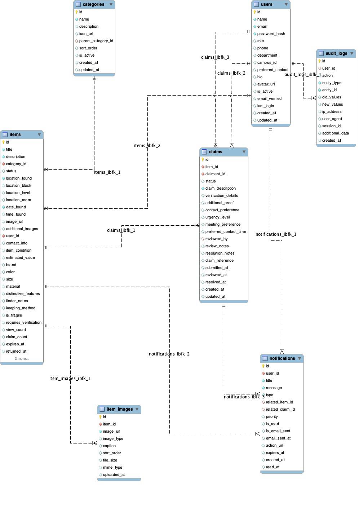
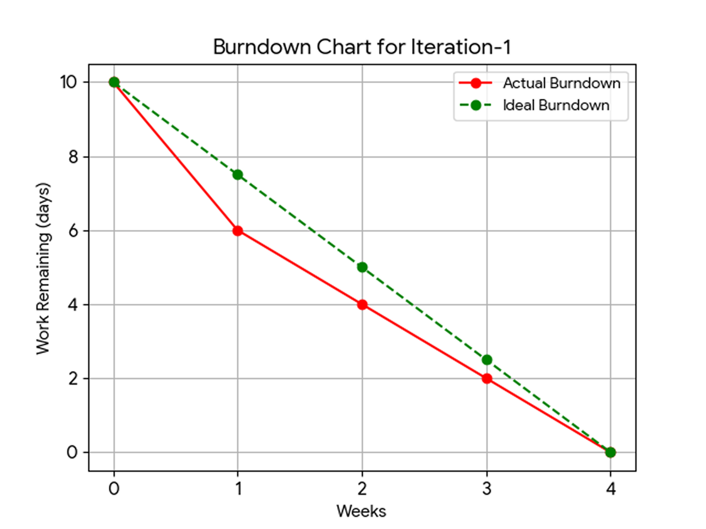
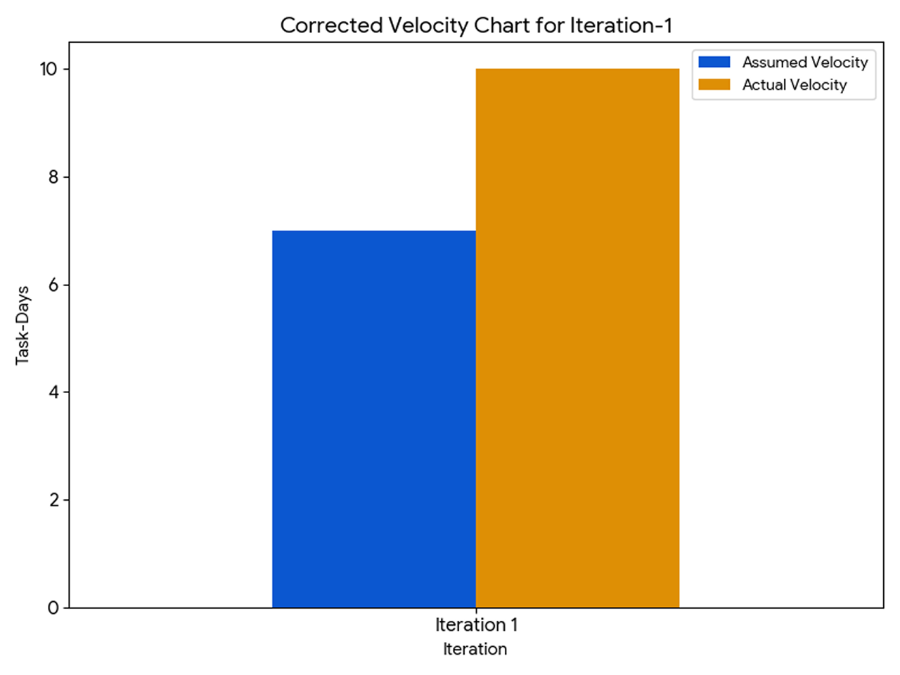
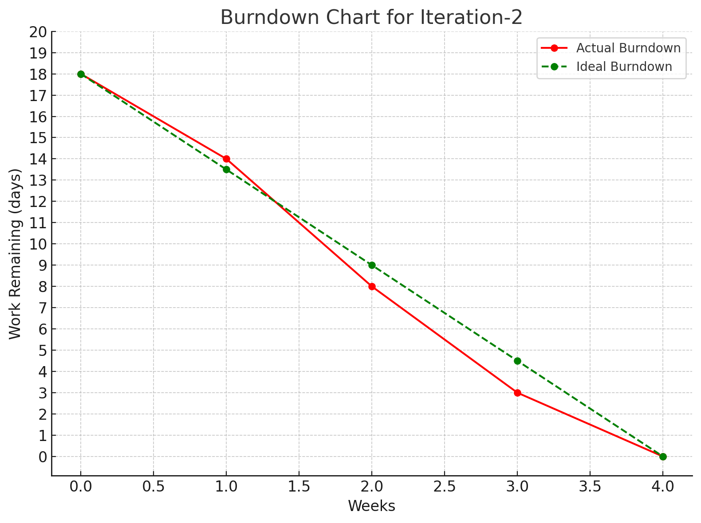
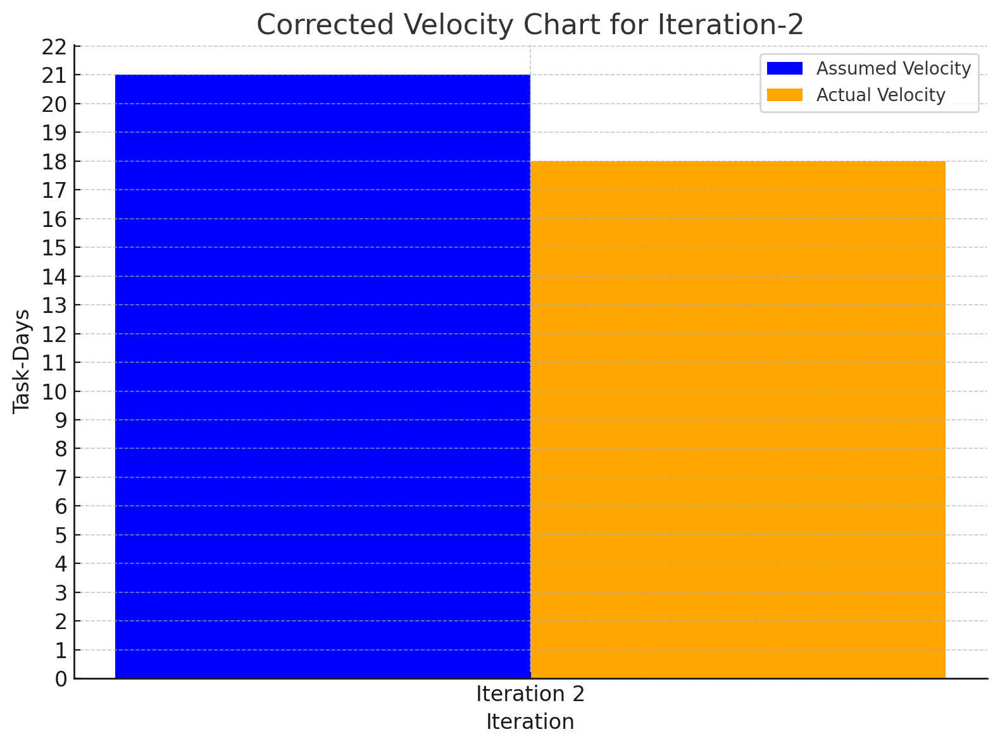

# Lost & Found Campus - Design Documentation

## Project Overview

The Lost & Found Campus system is a comprehensive web application designed to facilitate the reporting, searching, and claiming of lost items within a university campus environment. The system provides user authentication, item posting, advanced search capabilities, claim management, and administrative oversight functionality.

## System Architecture

### Technology Stack
- **Frontend**: React 18 with TypeScript and Material-UI (MUI) v5
- **Backend**: Python 3.8+ with custom HTTP server implementation
- **Database**: PostgreSQL with DigitalOcean cloud hosting
- **Cloud Storage**: AWS S3 for image storage and management
- **Authentication**: JWT-based authentication with bcrypt password hashing
- **API Design**: RESTful architecture with CORS support

### Database Design

#### Entity Relationship Diagram (ERD)

The database schema consists of the following core entities:

- **Users**: Student and staff accounts with role-based access control
- **Categories**: Hierarchical categorization system for items
- **Items**: Found items with detailed descriptions and metadata
- **Item Images**: Multiple image support for each item
- **Claims**: User requests to claim found items
- **Notifications**: System-wide notification management
- **Audit Logs**: Comprehensive activity tracking for security

#### Key Relationships
- Users have one-to-many relationships with Items (posted items)
- Users have one-to-many relationships with Claims (submitted claims)
- Categories support hierarchical parent-child relationships
- Items can have multiple associated Images
- Claims trigger Notifications to relevant users
- All system actions are tracked in Audit Logs

## Project Management & Development Iterations

### Iteration 1 - Foundation (June 10 - July 1, 2025)

**Core Features Delivered:**
- Basic item posting functionality
- Simple item viewing and searching
- Status-based filtering system

**Technical Achievements:**
- Established development workflow with 3-developer team
- Implemented basic HTTP server infrastructure
- Created initial JSON-based data storage
- Developed core React components
  
#### Burndown Chart

#### Velocity Chart

**Team Velocity:** 10 task-days completed (100% of estimated work)

### Iteration 2 - Advanced Features (July 2 - July 29, 2025)

**Core Features Delivered:**
- User authentication and registration system
- Item claiming workflow with verification
- User profile management
- Administrative dashboard
- Enhanced search with categories
- Item status management

**Technical Achievements:**
- Migrated from JSON to PostgreSQL database
- Implemented AWS S3 cloud storage integration
- Developed JWT-based authentication
- Created comprehensive admin interface
- Added audit logging and notification systems

#### Burndown Chart

#### Velocity Chart

**Team Velocity:** 18 task-days completed (100% of estimated work)

## System Features

### User Management
- **Registration**: Secure account creation with email verification
- **Authentication**: JWT-based login with password hashing
- **Profile Management**: User information and contact preferences
- **Role-based Access**: Regular users and system administrators

### Item Management
- **Item Posting**: Detailed form with image upload capabilities
- **Search & Discovery**: Advanced search with category filtering
- **Status Tracking**: Comprehensive item lifecycle management
- **Image Support**: Multiple images per item with AWS S3 storage

### Claim System
- **Claim Submission**: Detailed verification process for item recovery
- **Review Workflow**: Structured approval process by item finders
- **Notification System**: Real-time updates on claim status
- **Contact Facilitation**: Secure communication between parties

### Administrative Features
- **User Oversight**: Account management and moderation tools
- **Item Moderation**: Review and manage all posted items
- **Analytics Dashboard**: System usage statistics and reporting
- **Audit Trail**: Comprehensive logging of all system activities

## Technical Implementation

### Database Architecture
- **PostgreSQL**: Primary database with ACID compliance
- **UUID Primary Keys**: Enhanced security and scalability
- **Foreign Key Constraints**: Data integrity enforcement
- **Performance Indexes**: Optimized query performance
- **Full-text Search**: Advanced search capabilities

### API Structure
- **RESTful Design**: Standardized endpoint structure
- **CORS Support**: Cross-origin resource sharing enabled
- **Error Handling**: Comprehensive error response system
- **Authentication Middleware**: JWT token validation

### Cloud Infrastructure
- **AWS S3**: Scalable image storage solution
- **DigitalOcean**: Managed PostgreSQL hosting
- **Local Fallback**: Backup storage for high availability
- **Environment Configuration**: Team-shared development setup

### Frontend Architecture
- **Component-based Design**: Reusable React components
- **Material-UI**: Consistent design language
- **TypeScript**: Type-safe development environment
- **State Management**: React Context API for global state

## Security Considerations

### Authentication & Authorization
- **Password Security**: bcrypt hashing with salt rounds
- **JWT Tokens**: Secure session management
- **Role-based Access**: Administrative privilege control
- **Session Management**: Automatic token expiration

### Data Protection
- **Input Validation**: Comprehensive form validation
- **SQL Injection Prevention**: Parameterized queries
- **File Upload Security**: Type and size restrictions
- **Environment Variables**: Secure credential management

### Privacy Compliance
- **Personal Data Protection**: Secure handling of user information
- **Audit Logging**: Activity tracking for accountability
- **Secure Communication**: HTTPS enforcement
- **Data Retention**: Configurable data lifecycle policies

## Performance Optimization

### Database Performance
- **Strategic Indexing**: Optimized query performance
- **Connection Pooling**: Efficient database connections
- **Query Optimization**: Minimized database calls
- **Full-text Search**: Indexed search capabilities

### Storage Performance
- **AWS S3 Integration**: Scalable image storage
- **Local Backup**: High availability strategy
- **Image Optimization**: Size and format restrictions
- **CDN Ready**: Prepared for content delivery networks

### Frontend Performance
- **Component Optimization**: Efficient React rendering
- **Code Splitting**: Optimized bundle loading
- **Lazy Loading**: On-demand resource loading
- **Caching Strategy**: Browser and API response caching

## Development Workflow

### Team Collaboration
- **3-Developer Team**: Distributed development approach
- **Shared Environment**: Consistent development setup
- **Version Control**: Git-based workflow with GitHub
- **Code Review**: Structured review process

### Quality Assurance
- **TypeScript**: Static type checking
- **Error Handling**: Comprehensive error management
- **Testing Strategy**: Unit and integration testing
- **Documentation**: Comprehensive code documentation

### Deployment Strategy
- **Environment Separation**: Development, staging, production
- **Database Migration**: Structured schema updates
- **Configuration Management**: Environment-specific settings
- **Monitoring**: System health and performance tracking

## User Stories & Requirements

### High Priority Features
1. **User Authentication**: Secure account management system
2. **Item Claiming**: Comprehensive claim submission and review
3. **User Profiles**: Personal dashboard and activity tracking

### Medium Priority Features
4. **Admin Dashboard**: Comprehensive system management
5. **Item Status Management**: Detailed lifecycle tracking
6. **Enhanced Search**: Advanced filtering and categorization

## Technical Debt & Future Enhancements

### Immediate Improvements
- **Testing Framework**: Comprehensive unit and integration tests
- **Performance Monitoring**: Real-time system metrics
- **CI/CD Pipeline**: Automated deployment workflow
- **Mobile Responsiveness**: Enhanced mobile experience

### Future Features
- **Real-time Notifications**: WebSocket integration
- **Mobile Application**: Native mobile companion app
- **Analytics Dashboard**: Advanced reporting capabilities
- **Integration APIs**: Third-party system integration

### Scalability Considerations
- **Microservices Architecture**: Service decomposition strategy
- **Caching Layer**: Redis implementation for performance
- **Load Balancing**: Horizontal scaling capabilities
- **Database Sharding**: Large-scale data distribution

## System Statistics

### Database Schema
- **7 Core Tables**: Comprehensive data model
- **20+ Relationships**: Well-structured foreign keys
- **15+ Indexes**: Performance-optimized queries
- **5 ENUM Types**: Constrained data validation

### Codebase Metrics
- **Frontend**: React/TypeScript with 15+ components
- **Backend**: Python with 10+ API endpoints
- **Database**: PostgreSQL with comprehensive schema
- **Storage**: AWS S3 with local backup system

## Conclusion

The Lost & Found Campus system represents a modern, scalable solution for campus item recovery management. Through iterative development spanning two major iterations, the system successfully delivers a comprehensive platform that addresses the core needs of students, staff, and administrators.

The project demonstrates effective use of modern web technologies including React, TypeScript, PostgreSQL, and AWS services, while maintaining high standards for security, performance, and user experience. The modular architecture and comprehensive documentation ensure the system can adapt to future requirements and scale with institutional growth.

Key achievements include successful team collaboration across multiple developers, seamless integration of cloud services, implementation of robust security measures, and delivery of an intuitive user interface that facilitates efficient item recovery processes within the campus community.

*Documentation Last Updated: August 1, 2025*
